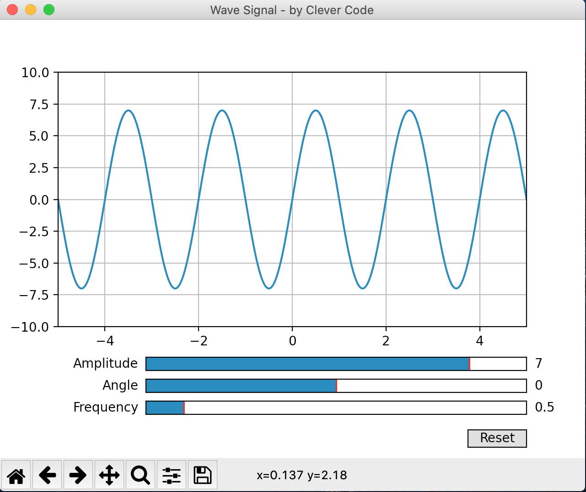

# Wave

## How to use my software?

First of all we need to create a virtual environment for the Python programming language, using this command on the terminal:

```
python3 venv venv
```

Now, we need to "activate" the virtual environment, using this command on the terminal:

```
source /venv/bin/activate
```

Well, now we install the dependencies with this command, always on the terminal:

```
pip3 install -r requirements.txt
```

If everything went well, just use the following command:

```
python3 main.py
```

to display the following window on your desktop:

<p align="center">
    
</p>

Hey, if you're wondering my name in art is [Clever Code](https://www.youtube.com/c/CleverCode) that's why you see it in the title of the window!

Fantastic! Now you can have fun changing all the characteristic parameters of a sinusoidal signal to see what happens!

For example with the default parameters you get the following output:

<p align="center">
    
</p>
