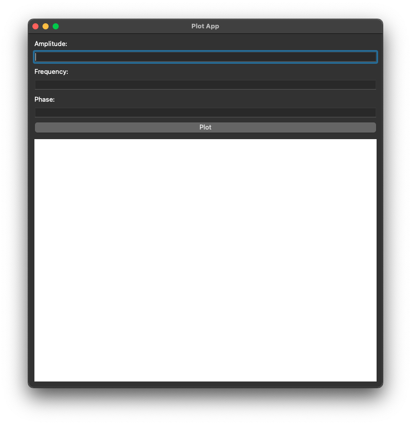
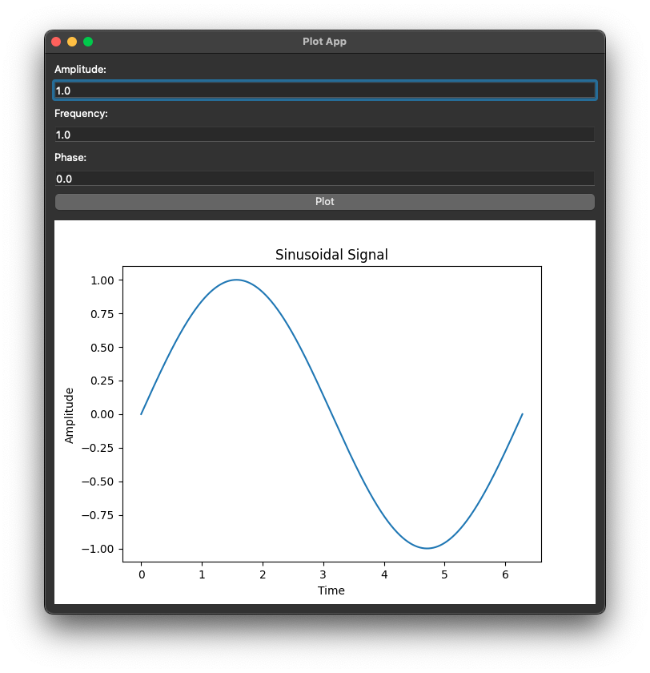

# How to use my software?

After creating your workbook you will need to create a virtual environment for the Python programming language, using this command on the terminal:

```
virtualenv venv
```

Now, we need to "activate" the virtual environment, using this command on the terminal:

```
source venv/bin/activate
```

Well, now we install the dependencies with this command, always on the terminal:

```
pip install -r requirements.txt
```

If everything went well, just use the following command:

```
python app.py
```

or ```make``` and next ```make run```, to display the following window on your desktop:

<p align="center">
	  
</p>

Fantastic! Now you can have fun changing all the characteristic parameters of a sinusoidal signal to see what happens!

For example, by clicking on the "Plot" button, leaving the default parameters, the following output is obtained:

<p align="center">
	  
</p>
